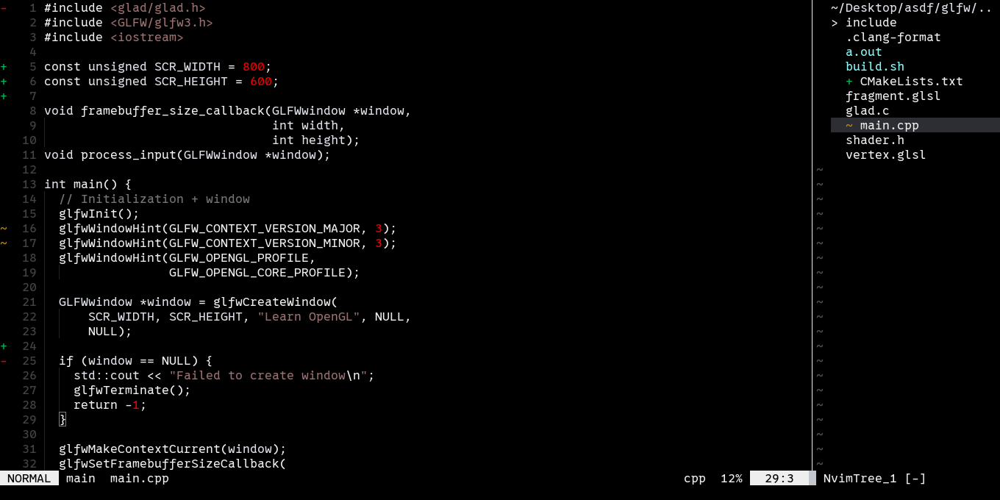
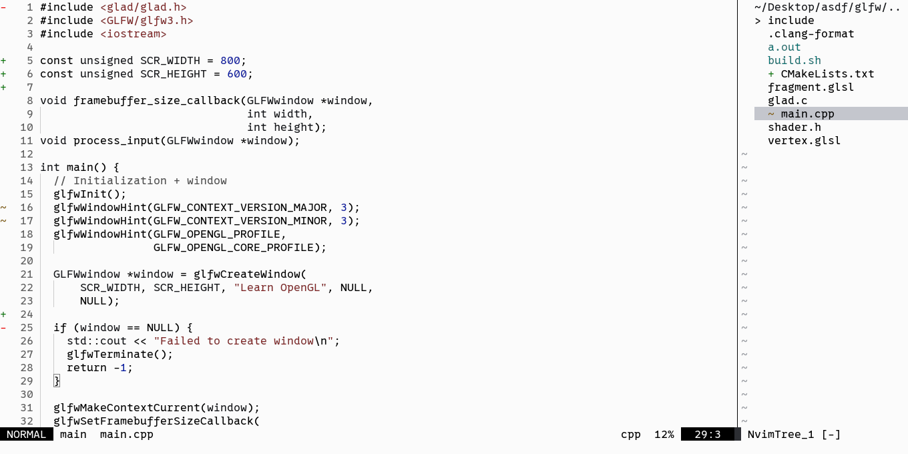

<h1 align="center">blank.nvim</h1>

Monochrome theme for Neovim, it only has syntax highlighting for strings, numbers, comments, and boolean.




The font used in pictures is 0xProto.

# Installation

### [lazy.nvim](https://github.com/folke/lazy.nvim)

```lua
{
  "funnyVariable/blank.nvim",
  lazy = false,
  priority = 1000,
  config = function()
    vim.cmd("colorscheme blank")
  end,
}
```
